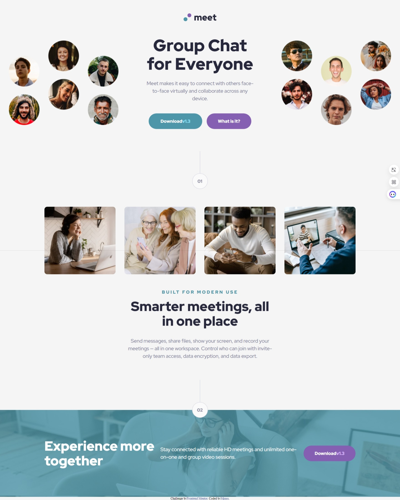
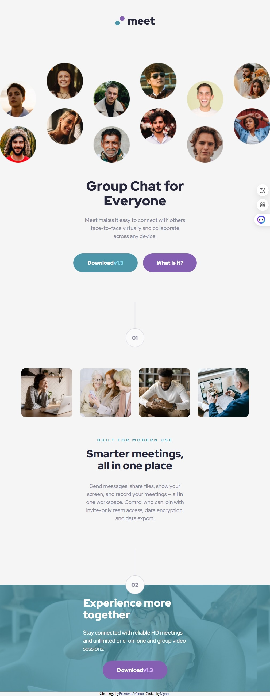
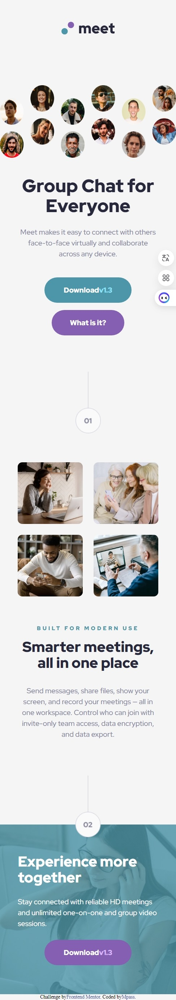

## Table of contents

- [Overview](#overview)
  - [The challenge](#the-challenge)
  - [Screenshot](#screenshot)
  - [Links](#links)
- [My process](#my-process)
  - [Built with](#built-with)
  - [What I learned](#what-i-learned)
  - [Continued development](#continued-development)
- [Author](#author)

## Overview

### The challenge

Users should be able to:

- View the optimal layout depending on their device's screen size

### Screenshot

-Desktop

-Tablet

-Mobile

### Links

- Solution URL: [https://github.com/Benson0721/Tailwind-meet-landing]
- Live Site URL: [https://benson0721.github.io/Tailwind-meet-landing/]

## My process

### Built with

- Semantic HTML5 markup
- CSS custom properties
- CSS grid layout
- Flexbox
- Scss
- TailwindCss
- Grid
- Mobile-first workflow
- [React](https://reactjs.org/) - JS library

### What I learned

Using Tailwind CSS has made it more convenient to build my projects, although I spent some time getting used to it. Additionally, my understanding of basic JavaScript concepts is still lacking, so I really need to practice more with JavaScript. I also want to thank another colleague from Front-End Mentor for introducing me to the BEM CSS methodology, which has been helpful in structuring my CSS.

### Continued development

I want to become more familiar with the tools I am using, so I will continue to practice in the future! I also plan to dedicate some time to practicing JavaScript.

## Author

- Github - [Mpass](https://github.com/Benson0721)
- Frontend Mentor - [@Mpass](https://www.frontendmentor.io/profile/Benson0721)
